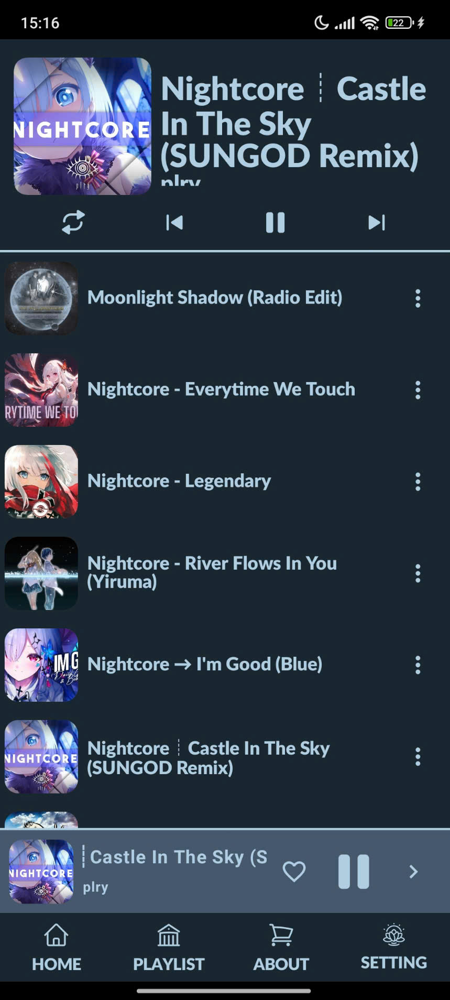
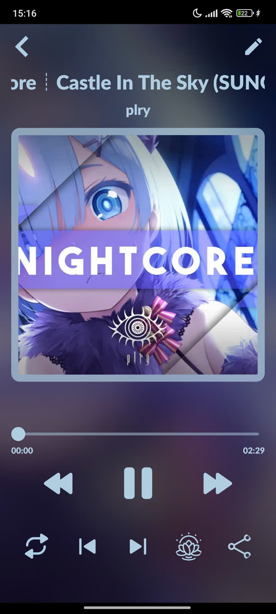
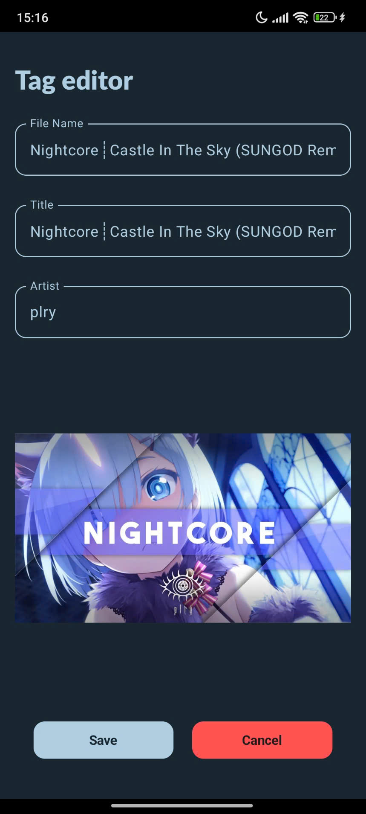
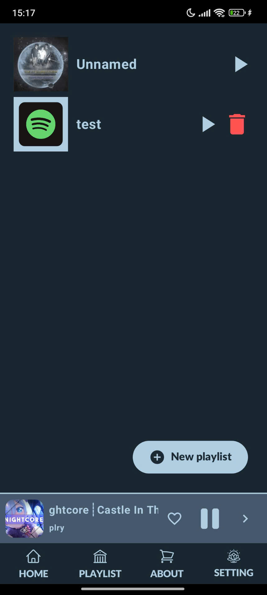
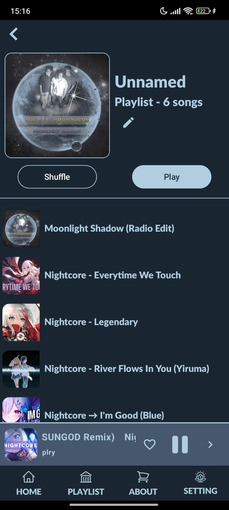
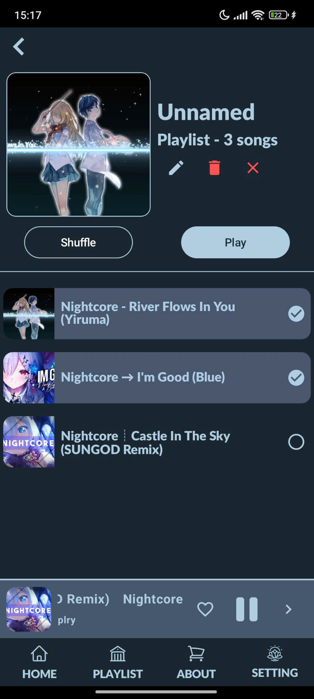

# MY MUSIC APP - Play music in background

## Screenshots

  
      
      
      

 

      
      
      

## Technology

• Architecture: MVVM Clean Architecture  
• Service: Foreground Service and Bind Service  
• Asynchronous programming: Coroutines  